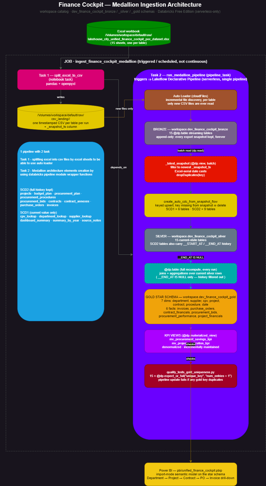
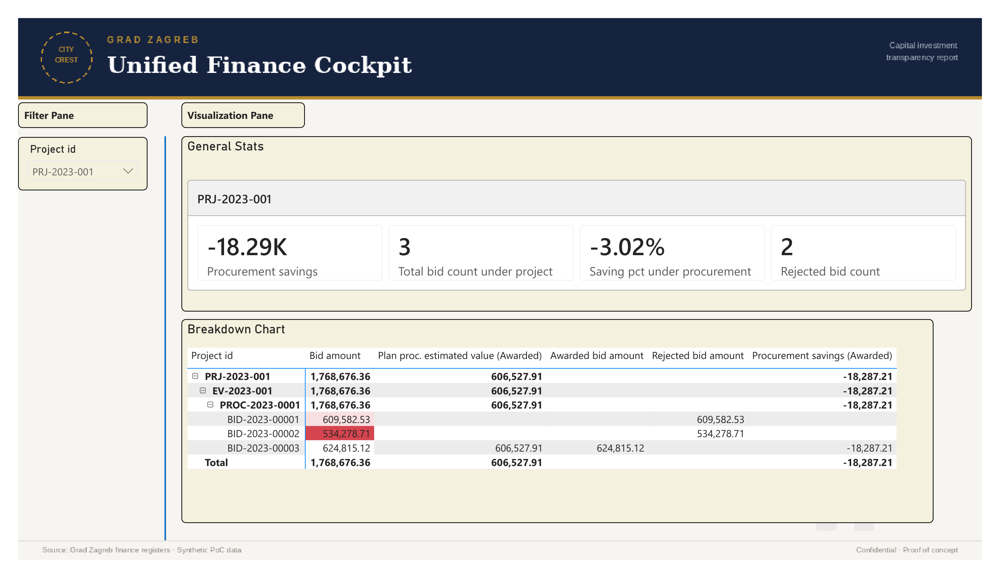
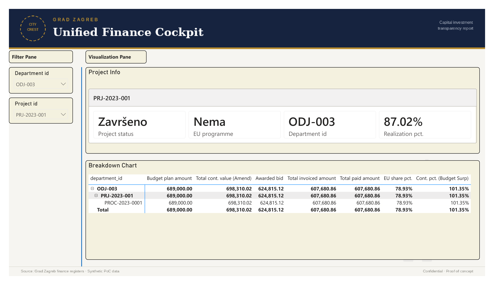
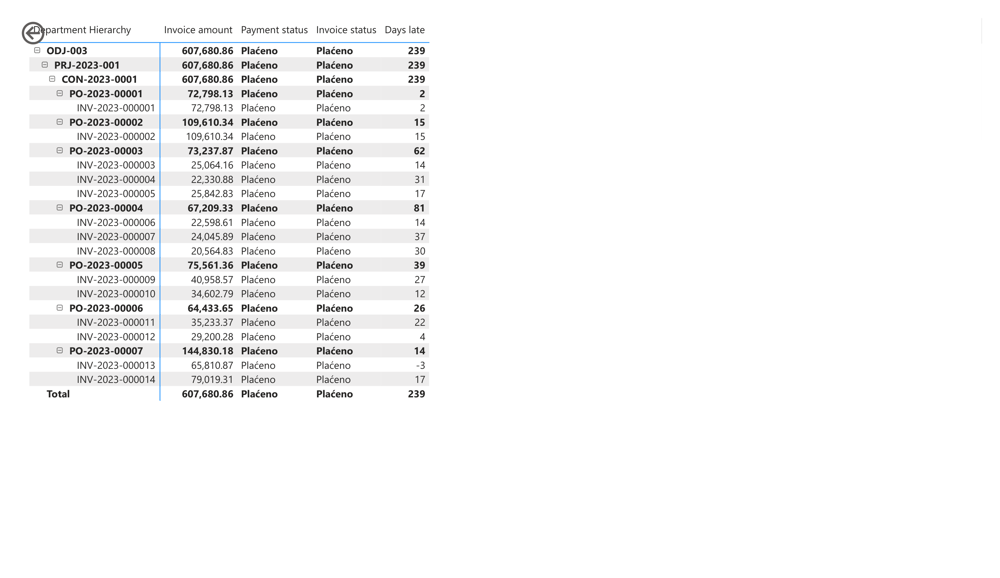

# db_works — Finance Cockpit Lakehouse

A medallion-architecture data pipeline for a city government's finance/procurement
dataset — projects, budgets, procurement procedures, bids, contracts, purchase orders and
invoices — built on Databricks Lakeflow Declarative Pipelines, with a Power BI star-schema
semantic model on top. Runs entirely on Databricks Free Edition (serverless-only).

## Source data

One Excel workbook (`/Volumes/workspace/default/raw/lakehouse_city_unified_finance_cockpit_poc_dataset.xlsx`),
15 sheets — one per business entity (projects, budget plan, procurement plan/procedures/bids,
contracts, annexes, purchase orders, invoices, plus lookup and summary sheets). It's treated
as a **periodic full re-export**, not a one-time load: every pipeline run re-reads the whole
workbook, and the pipeline is built to turn that into genuinely incremental, deduplicated,
audit-friendly tables anyway (see "Why this shape" below).

## Architecture



Editable source: [`docs/medallion_pipeline_architecture.drawio`](docs/medallion_pipeline_architecture.drawio)
(open with [diagrams.net](https://app.diagrams.net) or the VS Code draw.io extension) —
re-export the PNG after editing so this image stays in sync.

## Why this shape

**One pipeline, not three.** Databricks Free Edition allows only one active pipeline per
pipeline type. Bronze, silver and gold all live in this single Lakeflow pipeline, each
publishing to its own schema via fully-qualified `catalog.schema.table` names on every
`@dp.table`/`@dp.materialized_view` — see `resources/pipelines.yml`.

**Bronze is append-only by design.** Auto Loader tracks files it has already ingested by
path, not by content, so a fresh timestamped CSV per run is always picked up as new — no
`allowOverwrites` tricks needed. This means bronze accumulates every export ever taken,
which is intentional (a raw, replayable audit log) — don't query it for "current state,"
that's what silver is for.

**Handling deletes from a full-snapshot source.**
`create_auto_cdc_from_snapshot_flow` diffs each new snapshot against silver's current state
by key: a key present in silver but missing from the new snapshot is treated as deleted.
For SCD2 tables that means the record's validity window is closed
(`__END_AT` set) rather than the row being erased — a cancelled contract stays queryable as
history instead of vanishing.

**Ratios aren't stored as row-level percentage columns** in the star-schema fact tables
(`fact_procurement_performance`, `fact_project_financials`) — only the raw numerator/
denominator. A pre-computed percentage per row doesn't re-aggregate correctly once someone
slices by department or year in Power BI (averaging five projects' realization % isn't the
same as `SUM(paid)/SUM(planned)` across those five). The two KPI materialized views *do*
carry pre-computed percentages, since they're fixed at their native grain (one row per
project / per procedure) for direct dashboard or SQL consumption, not for further
re-aggregation.

**Monetary values are rounded to 2 decimals, percentages to 4,** on every gold output
column, to avoid `DOUBLE` floating-point noise (e.g. `9846353.430000002`) surfacing in
Power BI or ad-hoc SQL.

## Ingestion walkthrough: one invoice, start to finish

The "Excel → CSV → bronze → silver" hop is the same for every one of the 15 tables. Tracing
a single real row through all four stages end to end:

**1. Excel.** Sheet `09_invoices_ura`, one row for invoice `INV-2023-000002`. Excel doesn't
store dates as `2024-01-14` internally — it stores a **serial number**: days since
1899-12-30. `issue_date` is the integer `45305`, `due_date` is `45365`, `payment_date` is
`45380`. `invoice_amount` is `109610.34`, `payment_status` is `Plaćeno` ("Paid").

**2. CSV.** Task 1 (`00_split_excel_to_csv.py`) reads this sheet with pandas, which carries
each cell's value through as-is — it does *not* know `45305` is meant to be a date, so the
CSV line written to `csv_landing/invoices/invoices_<run_id>.csv` literally contains
`...,45305,45365,45380,109610.34,...,Plaćeno,...,2026-08-02T09:15:00.123456+00:00` — that
trailing value is `_snapshot_ts`, stamped onto every row this run produces.

**3. Bronze.** Auto Loader picks up that new file (never seen before at this path) and
infers column types from the raw CSV text: `issue_date`/`due_date`/`payment_date` become
plain `LONG`/`DOUBLE` columns holding `45305`/`45365`/`45380` — Auto Loader has no reason to
guess these bare integers are dates either. The row lands in
`workspace.dev_finance_cockpit_bronze.invoices` exactly as the CSV had it, `_snapshot_ts`
included, alongside every prior run's rows for other invoices.

**4. Silver.** The `invoices_latest_snapshot` view first filters bronze down to just this
run's batch (`_snapshot_ts = MAX(_snapshot_ts)`), *then* does the actual data-quality work:

```python
.withColumn("issue_date", F.expr("date_add(to_date('1899-12-30'), CAST(issue_date AS INT))"))
```

`45305` days after 1899-12-30 is `2024-01-14` — now a real `DATE`, not a number. Same for
`due_date` (`2024-03-14`) and `payment_date` (`2024-03-29`). From there, the derived columns
fall out directly: `payment_date` is not null, so `invoice_status` = `payment_status` =
`Plaćeno`; `days_late = datediff(payment_date, due_date) = 15` (paid 15 days after it was
due). `create_auto_cdc_from_snapshot_flow` then upserts this row into
`workspace.dev_finance_cockpit_silver.invoices` keyed on `invoice_id` — the finished row
carries real dates, `invoice_status`, and `days_late`, with no trace of the raw serial
numbers left anywhere downstream.

**How silver tracks changes.** Two separate mechanisms, one per layer of risk.

*Within one snapshot* — `invoices_latest_snapshot` ends with `.dropDuplicates(["invoice_id"])`,
collapsing any repeat rows for the same invoice the export itself might contain down to one,
before anything reaches silver.

*Across runs* — this is what decides, for every invoice on every run, whether nothing
happened, an existing row should update in place, or a new history version should open. It's
entirely in the parameters of `dp.create_auto_cdc_from_snapshot_flow`:

```python
dp.create_streaming_table(SILVER_INVOICES, comment="...")

dp.create_auto_cdc_from_snapshot_flow(
    target=SILVER_INVOICES,
    source="invoices_latest_snapshot",
    keys=["invoice_id"],
    stored_as_scd_type="2",
    track_history_except_column_list=["_snapshot_ts", "_rescued_data"],
)
```

- **`target`** — the table this flow maintains. `dp.create_streaming_table` declares it
  empty first; the flow is what actually fills it. Nothing else writes to it.
- **`source`** — where this run's "truth" comes from: the deduplicated, date-cast,
  latest-snapshot view built above. Every run re-derives this from bronze; it isn't a
  running total carried between runs.
- **`keys`** — the business key(s) that make a row "the same invoice." This is the actual
  deduplication mechanism: instead of blindly appending `source` rows onto `target`,
  Databricks looks up whether a row with this key already exists in `target`. Re-run the
  pipeline tomorrow with the same, unchanged `INV-2023-000002` in the export, and this key
  lookup is *why* it doesn't become a second row — it's recognized as an update-to-nothing,
  not a new insert.
- **`stored_as_scd_type`** — what "update" means when the key already exists. `"1"` (used
  for the 6 SCD1 tables — lookups, rollups) overwrites the existing row in place: always
  exactly one physical row per key. `"2"` (used here, and for the other 8 transactional
  tables) instead closes the old row's validity window (`__END_AT` set to now) and inserts a
  fresh one with `__END_AT` null — so "deduplicated" for an SCD2 table means one *current*
  row per key (`WHERE __END_AT IS NULL`), not literally one row ever; the closed-out
  versions are kept on purpose, as history.
- **`track_history_except_column_list`** — without this, `_snapshot_ts` (different on every
  run, by design) would look like "the row changed" to the SCD2 comparison, and a harmless
  re-run would open a pointless new version for every single invoice on every run. Excluding
  it means a version only opens when a real business column — `invoice_amount`,
  `payment_status`, etc. — actually changed.

**How gold stays unique per key.** Gold doesn't do any deduplication work of its own — it
just relies on the guarantee silver's SCD2 flow already gives it: at any moment, exactly one
row per key has `__END_AT IS NULL`. Every gold table built from an SCD2 silver source
applies that one filter before anything else, via a small shared helper repeated across
`dim_contract.py`, `dim_project.py`, `fact_invoices.py`, and the rest:

```python
def _current(df):
    return df.filter(F.col("__END_AT").isNull())
```

For `fact_invoices`, that's the entire mechanism:

```python
def fact_invoices():
    return (
        spark.read.table(SILVER_INVOICES)
        .filter(F.col("__END_AT").isNull())
        .select(
            "invoice_id", "purchase_order_id", "contract_id", "project_id",
            "issue_date", "due_date", "payment_date", "invoice_amount", "currency",
            "payment_status", "invoice_status", "days_late",
        )
    )
```

- **`.filter(F.col("__END_AT").isNull())`** — doesn't remove duplicate *current* rows (there
  never are any — SCD2 already guarantees that in silver). It removes *history*: every
  closed-out prior version of every invoice. What's left is exactly one row per
  `invoice_id`, the one currently valid.
- No `dropDuplicates`, no `GROUP BY`, no key logic of its own — uniqueness at gold grain
  falls straight out of silver's SCD2 guarantee; gold isn't re-establishing it, just not
  discarding it.
- The SCD1-sourced gold tables (`dim_department`, `dim_supplier`, `dim_cpv`) skip this filter
  entirely — their silver source never had `__START_AT`/`__END_AT` to begin with, so there's
  no history to filter out.

**Testing gold uniqueness, not just assuming it.** The mechanism above is a structural
guarantee, not a hope — but a guarantee is only worth something if it's actually checked.
`transformations/quality_tests_gold_uniqueness.py` adds one small validation table per gold
table, using Lakeflow's `@dp.expect_or_fail` expectation:

```python
@dp.materialized_view(
    name=f"{CATALOG}.{GOLD_SCHEMA}.test_unique_fact_invoices",
    comment="Fails the pipeline if fact_invoices ever has more than one row per invoice_id.",
)
@dp.expect_or_fail("unique_key", "num_entries = 1")
def test_unique_fact_invoices():
    return (
        spark.read.table(f"{CATALOG}.{GOLD_SCHEMA}.fact_invoices")
        .groupBy("invoice_id")
        .count()
        .withColumnRenamed("count", "num_entries")
    )
```

Expectations are row-level checks, but uniqueness is a dataset-level question no single row
can answer on its own — so each test groups by the key first (`num_entries` = how many rows
share that key), and the expectation asserts every group came out to exactly `1`. There's one
of these for all 15 gold tables (7 dims, 6 facts, 2 KPI views), each checked against its own
key (`department_id`, `contract_id`, `procedure_id`, ...).

`expect_or_fail` specifically (not `expect` or `expect_or_drop`) is the deliberate choice: a
duplicate key showing up in gold would mean the `_current()`/SCD2 guarantee actually broke
somewhere upstream, not that the source data was routinely messy. That's a bug, not noise —
so the whole pipeline update fails loudly and immediately rather than quietly shipping
duplicated rows into Power BI.

## Repo map

```
notebooks/
  00_split_excel_to_csv.py       Job Task 1 - Excel -> per-table timestamped CSVs

transformations/                 Lakeflow pipeline source (bronze + silver + gold, all of it)
  <table>.py                     bronze_<table> + silver_<table>, one file per source entity
  dim_*.py / fact_*.py           gold star schema
  mv_*.py                        gold KPI materialized views
  quality_tests_gold_uniqueness.py  one uniqueness expectation per gold table

resources/
  schemas.yml                    the 3 UC schemas (bronze/silver/gold)
  volumes.yml                    the raw landing volume
  pipelines.yml                  the one Lakeflow pipeline resource + its config
  jobs.yml                       the 2-task job (CSV split -> pipeline)

scripts/
  profile_bronze_delta_tables.py standalone profiler (null %, keys, FK candidates,
                                  duplicates) - run locally via Databricks Connect,
                                  results land under Desktop/db_works_profiling_results

pbi/
  unified_finance_cockpit.pbip   Power BI project (semantic model + report)

rag_agent/                       Local Streamlit app: ask the gold schema a plain-English
                                  question, answered by a Claude tool-use loop (schema catalog
                                  + live SQL against the gold warehouse) - see rag_agent/README.md

docs/
  medallion_pipeline_architecture.drawio   visual architecture diagram
```

## Running it

```bash
databricks bundle validate
databricks bundle deploy
databricks bundle run ingest_finance_cockpit_medallion   # full run: CSV split + pipeline
databricks pipelines run finance_cockpit_pipeline         # pipeline only, no new CSV export
```

Use `--full-refresh-all` on `pipelines run` after a change to CDC/history logic, so
existing tables get rebuilt cleanly rather than layering the change onto old state.

## Power BI

`pbi/unified_finance_cockpit.pbip` is an import-mode semantic model built directly on the
gold star schema. The drill hierarchy (Department → Project → Contract → Purchase Order →
Invoice) is wired through `dim_department → dim_project → dim_contract →
fact_purchase_orders → fact_invoices`; the two KPI views relate to their corresponding fact/
dim by key for direct use in visuals without needing DAX for the headline numbers.

Full report walkthrough: [`docs/unified_finance_cockpit_pbi_dashboard.pdf`](docs/unified_finance_cockpit_pbi_dashboard.pdf).
Quick glimpse of the three report pages:

**Procurement savings** — drills Project → Evidence → Procedure → Bid, comparing every bid
against the awarded one:



**Project realization** — budget plan vs. consolidated contract value vs. paid amount, plus
EU-funds share:



**Invoice drill-down** — the full Department → Project → Contract → Purchase Order → Invoice
hierarchy, with payment status and days late at the leaf level:



## Known constraints (Free Edition)

Serverless compute only, one SQL warehouse (2X-Small), max 5 concurrent job tasks, one
active pipeline per pipeline type. All of the above is designed within those limits — see
`resources/pipelines.yml` for how bronze/silver/gold share the single pipeline.
