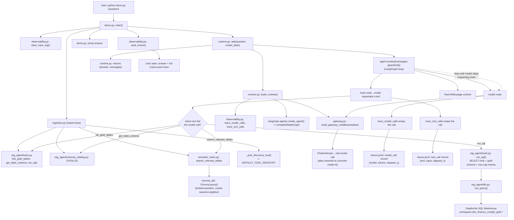

# Request lineage: one question, start to finish

Traces exactly which file calls which function, in order, for one real run of
`python demo.py "Which department has the worst procurement savings this year?"`.
Companion to `README.md` (what each pillar is *for*) — this is what actually *happens*.

## Diagram

## Narrative walkthrough

**1. Entry point.** `python demo.py "Which department has the worst procurement savings this
year?"` — `demo.py:main()` reads the question (or the hardcoded default) and
`DEMO_MODEL_ALIAS`/`DEMO_DISCOVERY` env vars.

**2. Registries assemble, once, at import time.** Importing `registries.py` pulls in
`rag_agent/tools.py` (the 3 already-tested functions from the working RAG agent) and
`rag_agent/schema_catalog.py`'s `CATALOG`, wraps each as a LangChain `@tool`, and calls
`_pick_discovery_tool()`: with the real catalog at 15 tables and `CATALOG_SIZE_THRESHOLD = 25`,
this resolves to `list_gold_tables` (the exhaustive-dump discovery tool), not
`search_relevant_tables` — unless `DEMO_DISCOVERY=semantic` forces the Chroma-backed path.
Either way, exactly 3 tools land in `DEFAULT_TOOL_REGISTRY`.

**3. `demo.py` prints the registries, then clears `traces.jsonl`** via
`observability.clear_trace_log()`, so this run's trace file starts empty.

**4. `runtime.ask()` assembles the runtime.** `build_runtime()` builds a nominal `ChatAnthropic`
model, then calls LangChain's `create_agent(model, tools, system_prompt, middleware=[...])`.
The `middleware` list is where gateway and observability actually attach:
`gateway.build_gateway_middleware(alias)` and `observability.trace_model_calls` /
`trace_tool_calls`. `create_agent()` compiles all of this into a LangGraph
`CompiledStateGraph` with `model` and `tools` nodes.

**5. `agent.invoke(...)` runs the actual loop.** Every time the graph's `model` node fires:
the gateway middleware intercepts first — resolves the alias to a real model id, checks the
session request budget, swaps in the real `ChatAnthropic` call — then observability's
`trace_model_calls` wraps that same call to time it and append a `model_call` record (model,
tokens, latency) to `traces.jsonl`.

**6. The model asks for a tool; the `tools` node fires.** `trace_tool_calls` wraps the call,
appending a `tool_call` record. Which function actually runs depends on which tool the model
picked:
   - `list_gold_tables` → `rag_agent/tools.py` → `schema_catalog.list_tables_summary()` (no
     network call — pure in-memory catalog read).
   - `search_relevant_tables` (only if the semantic path is active) → `semantic_index.py` →
     embeds the question locally, queries the persisted `chroma_db/` collection for the closest
     table embeddings, filters anything under `MIN_SIMILARITY`.
   - `get_table_schema` → `rag_agent/tools.py` → `schema_catalog.get_table()`.
   - `run_sql` → `rag_agent/tools.py`'s validation (SELECT-only, gold-schema allowlist, row
     cap) → `rag_agent/db.py: run_query()` → the live SQL warehouse →
     `workspace.dev_finance_cockpit_gold.<table>` → real rows back.

**7. Repeat.** Steps 5-6 loop — typically discovery tool, then `get_table_schema` for each
relevant table, then `run_sql` — until the model responds without requesting another tool.

**8. Final answer.** The loop's last message is the model's answer text
(`result["messages"][-1].content`), returned by `runtime.ask()` back to `demo.py`.

**9. `demo.py` prints the answer, then calls `observability.read_traces()`** to print every
`model_call`/`tool_call` record written to `traces.jsonl` during this one run — the full,
ordered trace of everything that just happened.

## Quick reference

| File | Role | Key functions | Reads / writes |
|---|---|---|---|
| `demo.py` | Entry point, orchestrates the printed walkthrough | `main()` | stdout |
| `registries.py` | Governed catalog of tools + data products; picks the discovery tool | `_pick_discovery_tool()`, `ToolRegistry`, `DataProductRegistry` | imports `rag_agent/tools.py`, `schema_catalog.py`, `semantic_index.py` |
| `gateway.py` | Model routing + request-budget policy, as middleware | `build_gateway_middleware()` | in-memory `_state.log`; constructs `ChatAnthropic` |
| `runtime.py` | Assembles and runs the LangGraph agent | `build_runtime()`, `ask()` | calls `create_agent()`, `agent.invoke()` |
| `observability.py` | Traces every model/tool call | `trace_model_calls`, `trace_tool_calls`, `read_traces()` | `traces.jsonl` (gitignored, regenerated per run) |
| `semantic_index.py` | Optional vector-search discovery path | `build_index()`, `search_relevant_tables()` | `chroma_db/` (gitignored, persisted Chroma collection) |
| `../rag_agent/tools.py` | The 3 actual capabilities (already tested in the working RAG agent) | `list_gold_tables()`, `get_table_schema()`, `run_sql()` | `schema_catalog.py`, `db.py` |
| `../rag_agent/schema_catalog.py` | Hand-maintained metadata for the 15 gold tables | `CATALOG`, `list_tables_summary()`, `get_table()` | none (static, in-memory) |
| `../rag_agent/db.py` | Databricks SQL warehouse connection | `run_query()` | live warehouse, via `databricks-sql-connector` |
